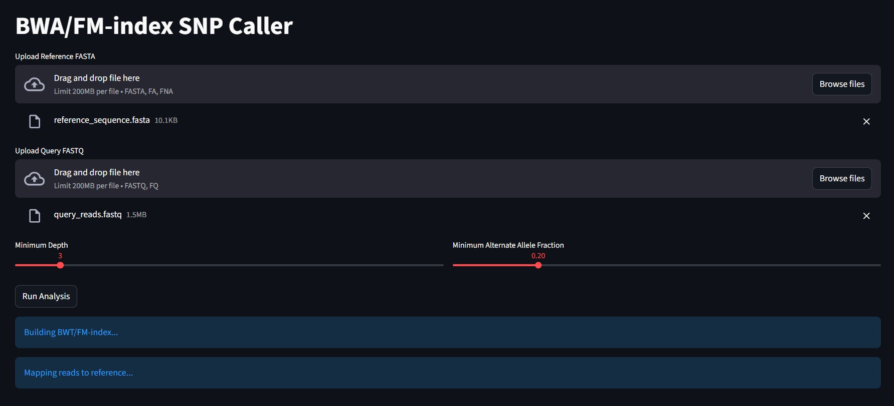
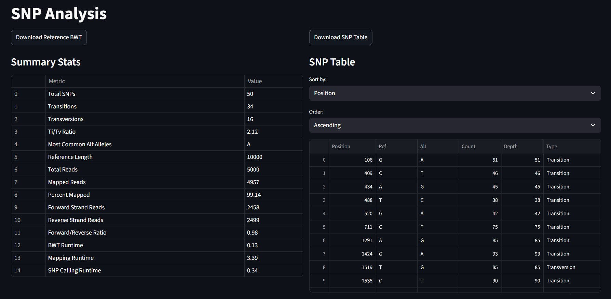
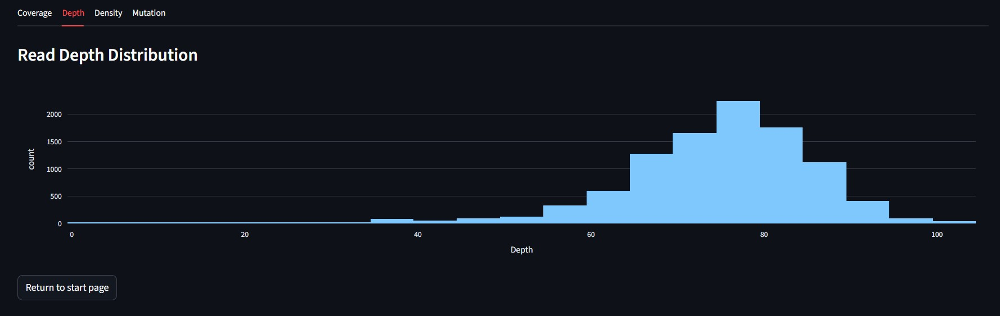

## Overview

This tool implements a simplified version of the Burrows-Wheeler Aligner (BWA) algorithm, combining:
- **BWT & FM-index construction** for efficient sequence searching
- **Dynamic seed-based read mapping** with Hamming-distance alignment
- **SNP calling** from aligned reads with configurable thresholds
- **Interactive Streamlit UI** for real-time analysis and visualization

## Biology Background

### What does this tool do?

In genomics, sequencing produces millions of short DNA reads that must be mapped back to a reference genome to identify variants (differences) between samples. This pipeline:

1. **Builds an indexed reference**: Constructs a Burrows-Wheeler Transform and FM-index for fast substring searching
2. **Maps reads**: Seeds reads into the reference using exact matching, then extends with up to 3 mismatches (Hamming distance)
3. **Calls SNPs**: Identifies positions where the reads differ from the reference, filtering by depth (coverage) and alternate allele frequency

### Key Concepts

- **FM-index**: A compressed full-text index based on the BWT that enables fast pattern matching
- **Seed-and-extend**: Finds exact matches for read segments (seeds), then extends to the full read allowing mismatches
- **SNP calling**: Variant detection via pileup analysis, counting bases at each position across all aligned reads
- **Transitions vs. Transversions**: Two classes of point mutations (A↔G and C↔T are transitions; others are transversions)

## Installation

### Requirements
- Python 3.8+
- Dependencies listed in requirements.txt

### Setup

```bash
pip install -r requirements.txt
```

## Usage

### Running the Application

```bash
streamlit run app.py
```

This launches the interactive Streamlit GUI at `http://localhost:8501`.

### Input Files

#### Reference FASTA
A multi-line FASTA file containing the reference genome sequence:

```fasta
>chr1
ACGTACGTACGTACGTACGTACGTACGTACGTACGTACGTACGTACGTACGTACGTACGT
ACGTACGTACGTACGTACGTACGTACGTACGTACGTACGTACGTACGTACGTACGTACGT
```

#### Query FASTQ
Sequencing reads in FASTQ format (typically from NGS):

```fastq
@read_1
ACGTACGTACGTACGTACGTACGTACGTACGTACGTACGT
+
IIIIIIIIIIIIIIIIIIIIIIIIIIIIIIIIIIIIIIII
@read_2
ACGTACGTACGTACGTACGTACGTACGTACGTAGTACGT
+
IIIIIIIIIIIIIIIIIIIIIIIIIIIIIIIIIIIIIIII
```

### Configuration Parameters

- **Minimum Depth**: Minimum read coverage at a position to call a variant (default: 3)
- **Minimum Alternate Allele Fraction**: Minimum proportion of reads supporting the alternate allele (default: 0.2)

## Output

### Downloads

1. **Reference BWT** (`reference_bwt.txt`): The Burrows-Wheeler transform of the reference sequence
2. **SNP Table** (`snps.csv`): Tabled SNPs with columns:
   - Position, Ref, Alt, Count, Depth, Type

Example SNP output:
```
Position,Ref,Alt,Count,Depth,Type
142,A,G,8,10,Transition
287,C,T,6,9,Transition
512,A,T,5,7,Transversion
```

### Interactive Visualizations

The workspace provides four tabs of analysis:

| Tab | Visualization | Insight |
|-----|---|---|
| **Coverage** | Line chart | Read depth across reference positions |
| **Depth** | Histogram | Distribution of coverage depths |
| **Density** | Bar chart | SNP count per 10% reference segment |
| **Mutation** | Heatmap | Transition/transversion matrix (ref → alt) |

### Summary Statistics

**SNP Stats:**
- Total SNPs, Transitions, Transversions, Ti/Tv ratio, Most common alternate allele

**Mapping Stats:**
- Reference length, total reads, mapped reads (%), forward/reverse strand ratio

**Runtime Stats:**
- BWT construction, read mapping, SNP calling times

## Project Structure

```
bwt_fmi_snp/
├── bwt_builder/             # BWT & FM-index construction
│   ├── bwt.py              # Suffix array & BWT generation
│   └── fmi.py              # FM-index with checkpoints & sampling
├── bwa_mapper/              # Read alignment
│   ├── aligner.py          # Hamming-distance seed extension
│   ├── mapping.py          # Dynamic seeding & alignment
│   └── snp.py              # SNP calling from pileups
├── stats/                   # Statistical analysis
│   ├── coverage.py         # Coverage computation
│   └── summary.py          # SNP & mapping statistics
├── ui/                      # Streamlit interface
│   ├── landing.py          # File upload & parameter config
│   ├── workspace.py        # Results visualization
│   └── states.py           # Session state management
├── tests/                   # Sample test data
│   ├── reference_sequence.fasta
│   └── query_reads.fastq
└── app.py                   # Main entry point
```

## Implementation Details

### BWT & FM-Index (bwt_builder)

- `build_suffix_array()`: Constructs suffix array via prefix doubling
- `build_bwt()`: Generates BWT from suffix array
- `FMIndex`: FM-index with:
  - **Checkpoints** for rank queries (sampling interval: 16)
  - **Suffix array sampling** for SA value recovery (sampling rate: 4)
  - **LF mapping**: $\text{LF}(i) = C(c) + \text{rank}_c(i)$

### Read Mapping (bwa_mapper)

- `generate_seeds()`: Extracts seed windows (12–16 bp) from read midpoints
- `search_exact()`: FM-index pattern search with backward search algorithm
- `extend_seed()`: Extends seeds allowing up to 3 mismatches (Hamming distance)
- Strand awareness: Tests both forward and reverse complement

### SNP Calling (snp.py)

Pileup-based variant calling:
1. Build position → base count histogram from alignments
2. Filter by depth ≥ min_depth
3. Flag alternates where `alt_count / depth ≥ min_alt_frac`

## User Interface

1.**Landing Page** (workflow entry):
   - File upload widgets
   - Parameter sliders (min depth, alt fraction)
   - "Run Analysis" button with progress messages
   


**Results Workspace**:
   - Summary statistics tables (SNP counts, mapping metrics, runtime)
   - SNP table with sorting controls
   - Four visualization tabs (coverage, depth, density, mutations)




## Example Workflow

1. **Upload** `reference_sequence.fasta` and `query_reads.fastq`
2. **Configure** minimum depth (e.g., 3) and alternate allele fraction (e.g., 0.2)
3. **Run** to trigger BWT/FM-index build, read mapping, and SNP calling
4. **Explore** results in workspace tabs
5. **Download** BWT and SNP table

## Performance

- **BWT Construction**: $O(n \log^2 n)$ where $n$ is reference length
- **Read Mapping**: $O(m \cdot s)$ per read (m = read length, s = seed count)
- **SNP Calling**: $O(a)$ where $a$ is total alignments

## Future Additions

- Support for multi-threaded mapping
- Gapped alignment (indels)
- Candidate alignment MAPQ scoring
- Read quality score integration
- Support for larger reference genomes
- Export to standard VCF format